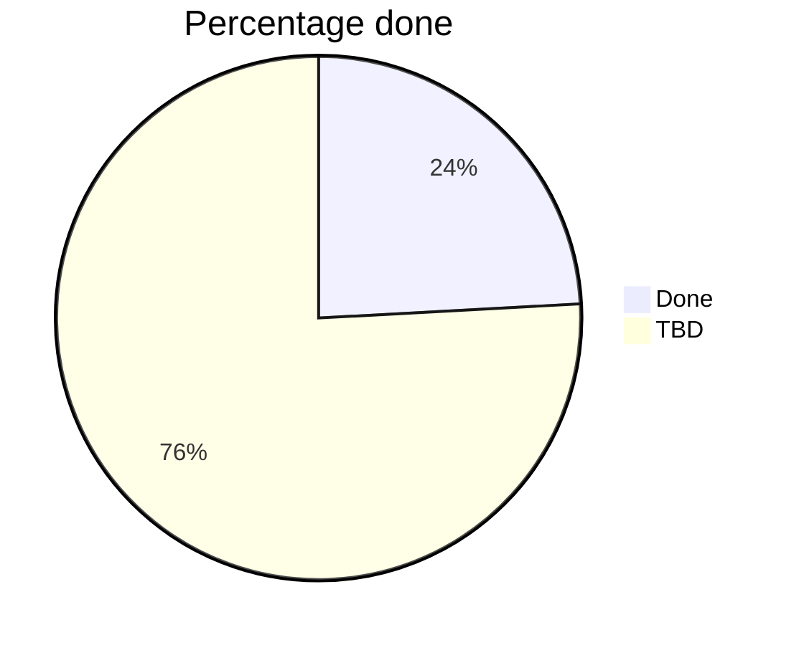

# Year 12-Software Engineering Major Project
My Software Project for Year 12, Hi Mr Calder

>[!NOTE]
>I had another github repo but on my personal account so i made a new github account and this repo.
> and like that other one had like three commits so like i may as well

# This is tha real documentation

 ## Questions about this repo:
 -  #### Why is this repo made so late in development?
     - *Because it used to be on my personal account, but then I didn't want it on my personal account so I made a new account and a new repo. Im so stupid.*
 - #### What is this meant to be?
   - *this is **supposed** to be a wikified version of the DSM-5 manual, thats like easy for people to use.*
 - #### If this is the "real documentation" are you still gonna do other documentation?
    - *Yeah, its worth 50%, I'm cooked.*

## If you are someone in my class snooping at my code
### To download my code
if you are someone in my class snooping around at my code, to download my code just paste in git

`git clone https://github.com/LiamMorar/Y12-Software-Engineering-Major-Proj.git`

its **NOT** good quality, I wouldnt look to it for an example of good-decent code
### To run it
you don't, you need the DB

## Scope
### Functional Requirements
- **Search**: by like keyword or tag.
- **CRUD**: **C**reate, **R**ead, **U**pdate, **D**elete entries.
- **Accounts**: register, login, roles (admin/editor/viewer), account settings, change password.
- **Version History**: see version history>(maybe).

### Non-functional Requirements
- **Usability**: intuitive UI, responsive layout.
- **Security**: password hashing, role based stuff. 
- **Performance**: LCP below like 5s, INP below 0.5s.
- **No large CLS**: CLS below 0.30.

### Out of scope
- **Real Psychiatrists**
- **Usefull information**
- **Full port of DSM**, probably just gonna be some sections

## TBD stuff

### Pages I made (none of them are finished)
- [x] index.html
- [ ] login.html
- [ ] register.html
- [x] search.html
- [x] post/admin.html (like a page for like >creating entries)
- [x] disorder.html (like the page for the disorder entries)
- [ ] header.html
- [ ] footer.html
 
### Task List
- **The basics**
    - [x] Basic Search
    - [x] Basic Tags
    - [x] Basic editing entries
    - [x] Basic creating entries
- **Accounts**
    - [x] Register function
    - [x] Login function
    - [ ] Register page
    - [ ] Login page
    - [ ] Roles and access 
    - [ ] Settings
    - [ ] Account management page
- **Entries**
    - [ ] Deleting entries
    - [x] Improved editing
    - [ ] Improved creating entries
    - [ ] Resize controls for stuff 
- **Other Stuff**
    - [ ] Reactive layout
    - [ ] *"Real"* documentation
    - [ ] Security stuff
    - [ ] Consistent UI
- **Optional Stuff**
    - [ ] Version history for entries
    - [ ] Restore to point
    - [ ] Optimisation

### Testing and Debugging
> "writing test cases for your code is doubting your own coding abilities. it's a sign of weakness." - Nietzsche (probably)

#### Testing I'll probs do later:
- System testing
- Performance testing
- Usability testing
- Fuzz testing
- Monke testing

#### Bug Tracking
TBD eventually

## Stuff Used
### Tools Used
- **Images**
    - Microsoft Paint
    - Powerpoint
    - Gimp
- **Version Control**
    - Github
- **Brainstorming**
    - It was revealed to me in a dream
- **Languages**
    - HTML
    - CSS
    - JS
    - PHP
- **IDEs**
    - Visual Studio Code
    - Visual Studio (i used both)

### Souces Used
- [DSM 5th edition](https://www.psychiatry.org/psychiatrists/practice/dsm)